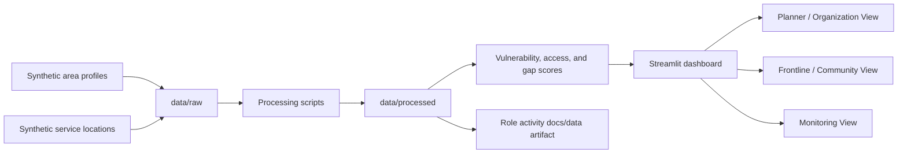

# Architecture

## Core Flow

## Data Layer

- `data/raw/`: synthetic input CSV files.
- `data/processed/`: cleaned, scored, and dashboard-ready CSV files.

No bronze, silver, or gold layers are used.

## Processing Layer

Processing is handled by `scripts/build_processed_data.py`, which calls package
logic under `src/comm_need_radar/`.

The pipeline:

1. Loads raw synthetic area and service records.
2. Validates required columns and coordinates.
3. Normalizes vulnerability indicators.
4. Calculates nearest-service distance and service counts by category.
5. Creates accessibility scores.
6. Combines vulnerability and access into a gap score.
7. Writes processed outputs, monitoring summaries, and the documented role
   activity artifact.

## Application Layer

The Streamlit app reads only `data/processed/` files.

Views:

- Planner / Organization View.
- Frontline / Community View.
- Monitoring View.

The Planner and Frontline views use clickable Plotly maps. Planner users can
select a priority area from the map and inspect service-access gaps by category.
Frontline users can select service points from the map and produce a filtered
flyer from nearby services.

## Deployment Position

Local execution is the default and required fallback. Cloud deployment can use
the same processed CSV files and app entrypoint if selected later.
